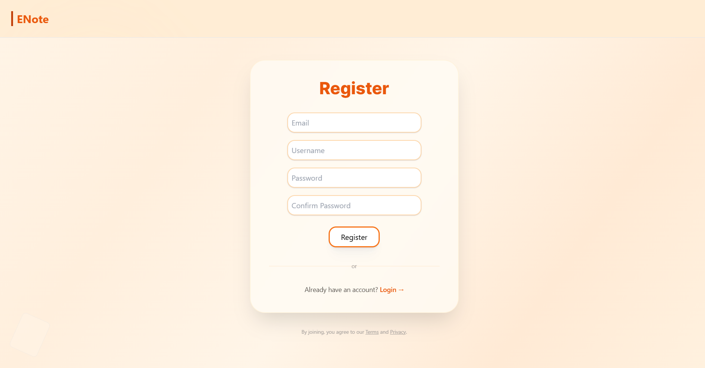
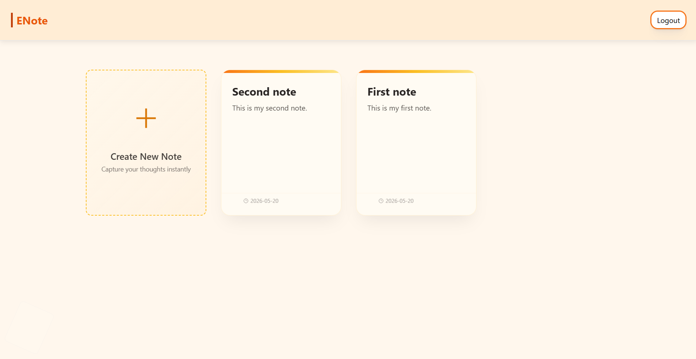
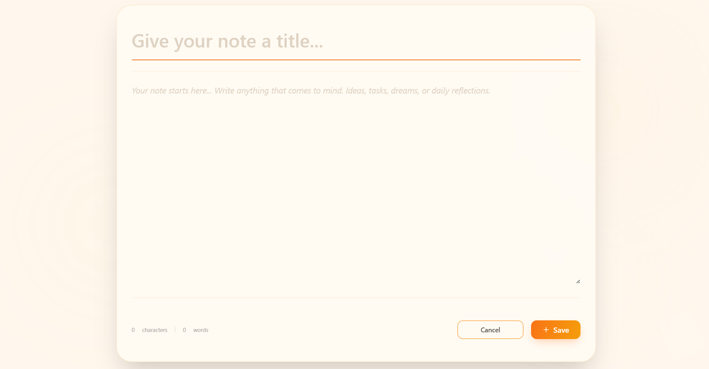

# MyNotes

> A Flask-based note-taking application that allows users to create, organize, and manage personal notes securely.

**Video Demo:** [<video_link>](https://youtu.be/wy3tHnSbyOo)

---

## Table of Contents

- [MyNotes](#mynotes)
  - [Table of Contents](#table-of-contents)
  - [About](#about)
  - [Features](#features)
  - [Technologies Used](#technologies-used)
  - [Screenshots](#screenshots)
  - [Function **Overview**](#function-overview)
    - [`index()`](#index)
    - [`home()`](#home)
    - [`login()`](#login)
    - [`logout()`](#logout)
    - [`register()`](#register)
    - [`create()`](#create)
    - [`add()`](#add)
    - [`note()`](#note)
    - [`update()`](#update)
  - [Validations](#validations)
  - [Getting Started](#getting-started)
  - [Conclusion](#conclusion)

---

## About

MyNotes is a web application built using Python and Flask that enables users to securely create, store, and manage notes. The project demonstrates important backend concepts including user authentication, session management, database integration, form validation, and CRUD operations.

---

## Features

- User registration and authentication system
- Secure password hashing
- Session-based login management
- Create personal notes
- Update existing notes
- View notes sorted by recent activity
- Individual user note storage
- Flash messages for user feedback

---

## Technologies Used

| Technology | Purpose |
|------------|----------|
| Python | Backend logic |
| Flask | Web framework |
| SQLite | Database storage |
| CS50 SQL | Database interaction |
| Jinja2 | HTML templating |
| HTML | Frontend structure |
| Tailwind CSS | Styling |
| Werkzeug Security | Password hashing |

---

## Screenshots






---

## Function **Overview**

### `index()`
Displays the landing page of the application.

- Loads the homepage interface
- Entry point for users

### `home()`
Displays all notes belonging to the currently logged-in user.

- Retrieves user notes from database
- Sorts notes by latest updated time
- Passes notes to the dashboard

### `login()`
Handles user authentication.

- Validates email and password
- Checks hashed password
- Creates session for authenticated users
- Redirects after successful login

### `logout()`
Logs users out of the application.

- Clears active session
- Redirects users to homepage

### `register()`
Handles new user registration.

- Validates registration form
- Creates hashed passwords
- Stores users securely
- Automatically logs users in after registration

### `create()`
Displays note creation page.

- Loads form for adding notes

### `add()`
Creates a new note.

- Validates title and content
- Stores note in database
- Saves creation and update timestamps

### `note()`
Displays an individual note.

- Retrieves note by ID
- Ensures note belongs to authenticated user

### `update()`
Handles note updates.

- Updates title and content
- Prevents empty updates
- Updates modification timestamp

---

## Validations

The application applies validations to maintain proper data integrity:

| Field | Rule |
|---------|------|
| Username | Cannot be empty |
| Email | Must be provided |
| Password | Must be provided |
| Note Title | Cannot be empty |
| Note Content | Cannot be empty |
| Note Update | Changes must exist before updating |

---

## Getting Started

```bash
# Clone repository
git clone <your-repo-url>

# Navigate into project
cd mynotes

# Install dependencies
pip install flask
pip install cs50

# Run application
python app.py
```

Then open your browser and navigate to:

```text
http://127.0.0.1:5000
```

---

## Conclusion

MyNotes provides a clean and efficient note management experience while demonstrating key software development concepts:

- Authentication and authorization
- Session management
- CRUD operations
- Database integration with SQLite
- Password security using hashing
- Form validation and error handling
- Backend development with Flask
